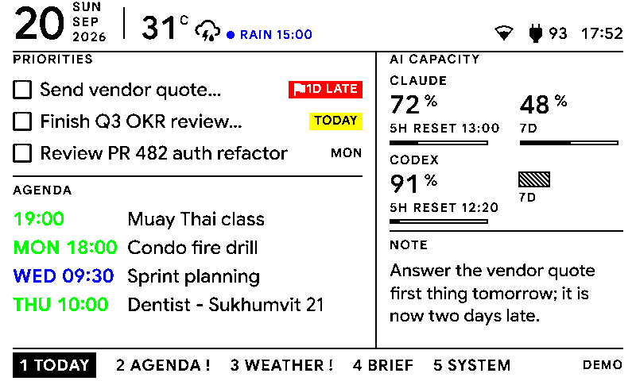
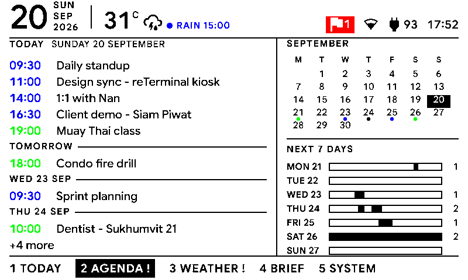
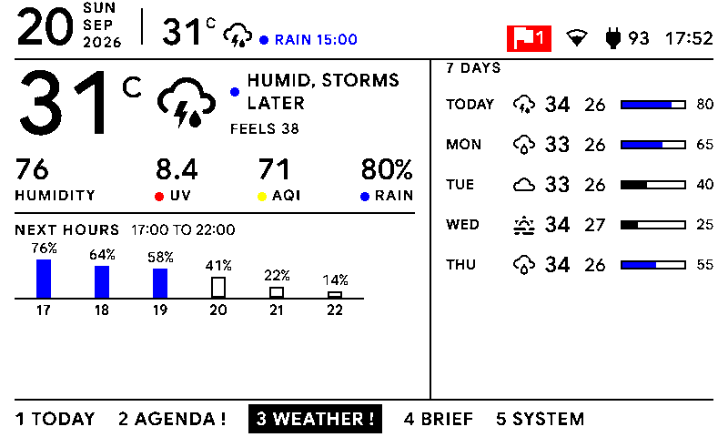
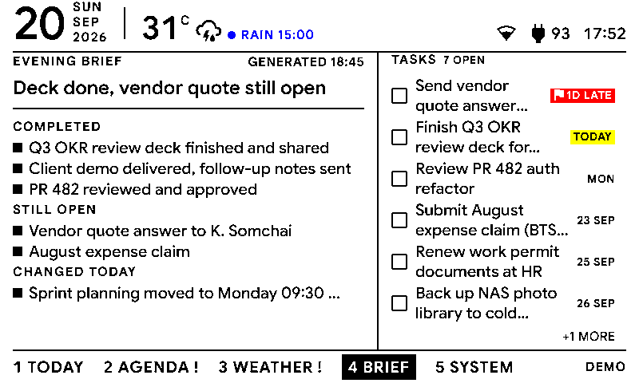
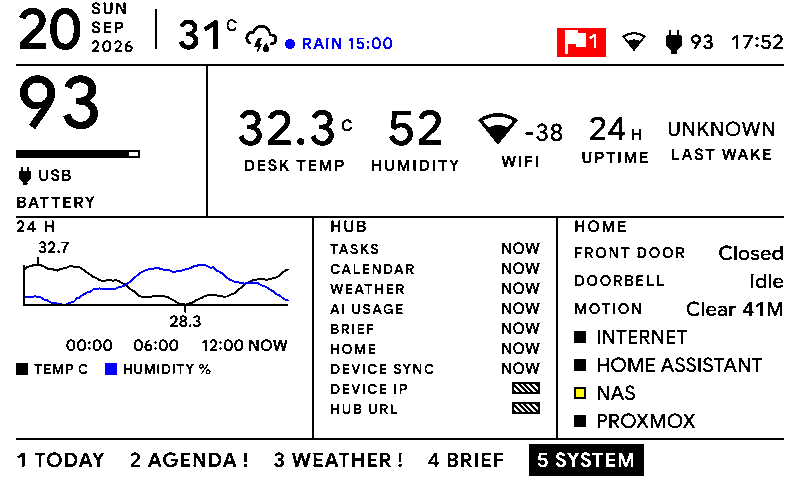
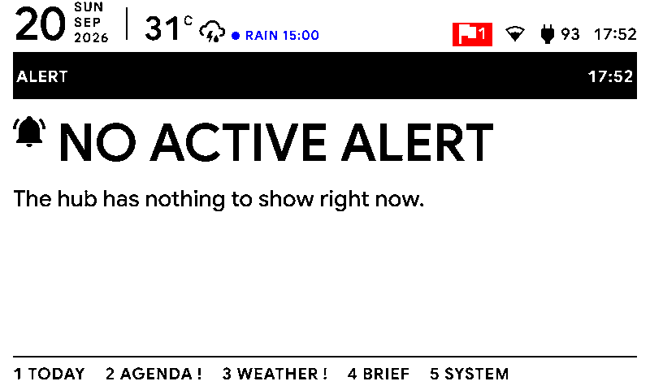

# deskmate

A local-first desk dashboard for any ESPHome device that fetches an 800x480
six-color PNG and posts telemetry back. `firmware/e1002.yaml` is the
reference firmware, built for the Seeed Studio reTerminal E1002 (ESP32-S3).
Other display sizes are not supported today: every page template is laid
out in fixed pixel budgets (see DESIGN.md).

## Screenshots

| | |
| --- | --- |
|  Today |  Agenda |
|  Weather |  Brief |
|  System |  Alert |

These are the demo fixture renders at the panel's 800x480 six-ink output;
open `/preview` on a running hub for a live view.

All the logic lives in a small server called **dashboard-hub**: it fetches
calendar, weather and Home Assistant state itself, accepts AI quota, an
AI-written brief and open tasks pushed over HTTP by a remote agent (see
[skills/deskmate/SKILL.md](skills/deskmate/SKILL.md)), renders one of six
pages to an 800x480 PNG constrained to the panel's six colors, and serves it
over the LAN. The device is a thin display client that downloads a PNG and
shows it.

```
Data sources -> dashboard-hub (FastAPI + Jinja2 + Chromium at 4x + Lanczos + Pillow)
             -> 800x480 six-color PNG over HTTP -> ESPHome device (reference: reTerminal E1002)
```

Pages: `today`, `agenda`, `weather`, `brief`, `system`, `alert`.

Status (2026-09-20): dashboard-hub is deployed with Docker. Setup, every
setting, and backup, restore and rotate are a web page (`/setup`,
`/settings`; see docs/SETTINGS.md), not `.env` edits, holding one SQLite
database (identity, settings, pushed datasets, telemetry). Every panel page
is a module: the settings page's Modules section enables, disables and
orders them, and a third-party module can be dropped in without touching
the hub's own code (see docs/MODULES.md). The General section also picks the
header widget shown in every page's header (weather by default), and the
Modules section can override it per page. The built-in modules serve the
Today, Agenda, Weather, Brief and System pages plus alerts, each pulling
from its configured source or, honestly, reporting unavailable; an optional
Home Assistant dashboard module screenshots a Lovelace view straight to the
panel instead (off by default, see docs/HA-DASHBOARD.md). Firmware
provisioning - Wi-Fi, the hub URL and the device key set at runtime rather
than baked into the firmware - is compiled and validated against ESPHome
2026.8.2; the owner flashes it onto the E1002 themselves (see
docs/FLASHING.md). The Device section on `/settings` also sets the device's
refresh schedule (refresh and telemetry intervals, wake hours), which the
device picks up at its next telemetry check-in without a reflash.

## Quick start

Requires Python 3.12 and [uv](https://docs.astral.sh/uv/).

```sh
cd dashboard
uv sync --all-groups
uv run playwright install chromium

# run the server, then open http://127.0.0.1:8080/setup in a browser
uv run uvicorn app.main:create_app --factory --host 127.0.0.1 --port 8080
```

The wizard claims the hub, shows the bearer token and device key once, and
walks a few settings sections; skip any of them and configure the rest on
`/settings` afterwards (see docs/SETTINGS.md). A freshly claimed hub with
nothing configured renders an honest empty state instead of demo data on
every page.

To see the demo pages without a server, or without configuring anything:

```sh
uv run python ../scripts/render-all.py
```

This renders every page to `../output/` with every source pinned to
`fixture` (each built-in module's own `app/modules/<id>/fixtures/` files,
unaffected by anything on `/settings`).

Then open <http://127.0.0.1:8080/preview> to flip through the pages: the raw
HTML by default, with a toggle to switch to the simulated panel PNG. A fresh,
unconfigured hub serves nothing but `/setup`; once you set it up (see Setup
below), a browser needs to sign in at `/login` with the token or the device
key first.

Tests:

```sh
cd dashboard && uv run pytest
```

## Docker quick start

```sh
cp .env.example .env      # optional; with no .env the hub shows an honest
                           # empty state until you configure real sources
docker compose up -d --build
docker compose logs dashboard-hub   # first run: confirms setup is needed
curl -s http://127.0.0.1/healthz
curl -o today.png http://127.0.0.1/display/today.png   # 503 until set up
```

If host port 80 is already in use, or needs no privileges, set `HUB_PORT` in
`.env` (for example `HUB_PORT=8080`) and use that port in the URLs above and
in the device's `hub_base_url`.

The compose service mounts `./data` read-write (the hub's own database,
`deskmate.sqlite`); the demo fixtures are baked into the image, no volume
needed.

### Setup

A fresh hub is unconfigured: it serves nothing but `GET`/`POST /setup`,
`GET /healthz` (minimal body), `/static`, `/docs` and `/openapi.json` -
`GET /` and every reader route redirect or answer `503` until it is set up,
and firmware telemetry answers `503` too. There is no claim code: the first
`POST /setup` to reach the hub wins, so set it up right after the first
start. It is guarded by address instead - only a caller on this machine's
own loopback or private network may call it; anyone else gets `403`. That
guard sees whoever made the TCP connection, so a reverse proxy in front of
the hub defeats it (every caller looks like the proxy's own private
address); see "Reverse proxy" in [docs/DEPLOY.md](docs/DEPLOY.md). Open
`http://127.0.0.1/setup` and enter a hub name and the public base URL.
The result page shows **two secrets**, each **once**; save both, there is no
way to see either again: a bearer token for agents (read and write), and a
device key for the E1002 firmware (read only). Claiming the hub also signs
you in as admin and offers a short setup wizard for the timezone, weather
location, calendar feeds and Home Assistant; everything else (tasks, AI
usage, brief, device, backup, rotate) is on `/settings` afterwards - see
[docs/SETTINGS.md](docs/SETTINGS.md). Push endpoints and
`POST`/`DELETE /api/alert` need `Authorization: Bearer <token>`; every read
route needs the token, the device key, or a browser session from `/login`.
See [docs/DEPLOY.md](docs/DEPLOY.md) for the full server setup and
[skills/deskmate/SKILL.md](skills/deskmate/SKILL.md) for how an agent pushes
data once it has the token. Once you have the token, set up an agent to
push data with [docs/LOCAL-AGENT.md](docs/LOCAL-AGENT.md).

## Endpoints

Once the hub is set up, every row below except `/setup` and `/login` needs
a credential: the bearer token or device key as `Authorization: Bearer <...>` for a read, only the
token for a write (an admin session or the token for a settings route), and
a `/login` session cookie also works for a read from a browser. Before it
is set up, every one of these answers `503` (the reader and admin routes)
or redirects to `/setup` (`/preview` and `/`). See "Auth" in
[docs/ARCHITECTURE.md](docs/ARCHITECTURE.md) for the full rule.

| Method | Path | Notes |
| --- | --- | --- |
| GET | `/healthz` | Liveness. Last known status per adapter, never fetches; `unknown` before the first render. `GET /api/state` forces the adapters. Always `200`; a minimal body while unconfigured or for an unauthenticated caller once set up |
| GET, POST | `/setup` | Set up the hub (see Setup above); open, guarded by the caller's address, not a credential |
| GET, POST | `/setup/{step}` | The setup wizard's optional steps; admin only |
| GET | `/login` | Sign in with the token (admin) or the device key (reader); sets a session cookie |
| GET | `/settings` | Every settings section, backup, restore and rotate; admin only, see [docs/SETTINGS.md](docs/SETTINGS.md) |
| GET | `/api/hub` | Hub name, base URL, configured, `sources` (`{dataset: {source}}` for each pushed dataset) |
| GET | `/api/state` | Schema 2: `{schema, generated_at, timezone, blocks, alert}`, `blocks` keyed by dataset name, the state the pages render from |
| GET | `/display/{page}.png` | 800x480 PNG by page id (`today`) or its 0-based index in the window list (`/display/0.png`); `ETag` + `304`, `?t=` busts the cache |
| GET | `/preview` | Developer page for switching between pages |
| GET | `/preview/{page}.html` | Raw HTML at 800x480, for CSS work |
| POST | `/api/ai-usage`, `/api/brief`, `/api/tasks` | Agent pushes, token required |
| POST | `/api/alert` | Set the current alert, token required; only reaches the device while it is awake and on USB power, see docs/DATA-SOURCES.md |
| DELETE | `/api/alert` | Clear it, token required |
| POST | `/api/device/telemetry` | Device pushes one sample every 5 min, `202` with `page_count` and `pages` (enabled page ids, in order), token or device key required |
| GET | `/api/device/telemetry` | Latest sample plus sample count, oldest, newest |
| GET | `/api/device/history` | `?hours=24`, downsampled to at most 300 points |

Full request and response shapes: `GET /openapi.json`, or `/docs` for the
interactive Swagger UI.

## Layout

| Path | Purpose |
| --- | --- |
| `dashboard/` | The dashboard-hub server, its Dockerfile and tests. Each built-in module carries its own demo data under `app/modules/<id>/fixtures/` |
| `data/` | The hub's own database, `deskmate.sqlite` (identity, settings, pushed datasets, telemetry). Gitignored |
| `output/` | Generated example PNGs. Gitignored |
| `docs/` | Architecture, data sources, deploy, settings, hooks, flashing, factory restore |
| `skills/` | `deskmate/SKILL.md`, how a remote agent pushes data to the hub |
| `scripts/` | Backup, verify and render helpers |
| `firmware/` | ESPHome YAML for the E1002, secrets example, its own venv |
| `private-backups/` | Factory flash dumps. Gitignored, sensitive |

## Firmware and hardware

Tooling is split on purpose: root `.venv` holds esptool 5.4 for backups and
restore, `firmware/.venv` holds ESPHome (it pins its own esptool).

```powershell
uv sync                                   # root: esptool
cd firmware; uv venv .venv --python 3.12; uv pip install --python .venv\Scripts\python.exe esphome
```

- Backup (read only): `scripts\backup-firmware.ps1 -Port COM3`, or the chunked
  reader `scripts\dump-flash-chunked.py` when the CH340 link drops packets.
  Verify with `scripts\verify-backup.py`.
- Firmware config: `firmware\e1002.yaml`, secrets in `firmware\secrets.yaml`
  (copy from `secrets.yaml.example`, gitignored).
- Validate and compile without touching the device:
  `firmware\.venv\Scripts\esphome.exe config firmware\e1002.yaml` and
  `... compile firmware\e1002.yaml`.
- Flashing and bring-up: `docs/FLASHING.md`. Recovery: `docs/FACTORY-RESTORE.md`.

Device behaviour: left white button previous page, right white button next
page, green short press refresh, green long press back to Today. Home
Assistant can call `esphome.reterminal_e1002_show_alert` with `duration` and
`beep` to show `/display/alert.png` and return afterwards.

## Docs

- [docs/ARCHITECTURE.md](docs/ARCHITECTURE.md) - the binding spec: endpoints,
  auth, palette, storage, refresh policy.
- [docs/SETTINGS.md](docs/SETTINGS.md) - the setup wizard, the settings page
  and every section's fields, backup and restore, rotate, reset, the
  one-time legacy import.
- [docs/DATA-SOURCES.md](docs/DATA-SOURCES.md) - how to configure each
  section's source, the push endpoints, the alert API and a Home Assistant
  example.
- [docs/MODULES.md](docs/MODULES.md) - writing a module: the page and
  dataset contract, how to install one, and the minimal example at
  `examples/modules/hello/`.
- [docs/HA-DASHBOARD.md](docs/HA-DASHBOARD.md) - the optional Home Assistant
  dashboard module: settings, making a long-lived access token, and
  building a Lovelace view that survives six-ink quantization.
- [skills/deskmate/SKILL.md](skills/deskmate/SKILL.md) - how a remote agent
  pushes AI usage, a brief and tasks to the hub.
- [docs/HOOKS.md](docs/HOOKS.md) - a POSIX sh hook that pushes AI quota
  numbers whenever they change.
- [docs/LOCAL-AGENT.md](docs/LOCAL-AGENT.md) - setting up an external agent
  that pushes AI usage, a brief and tasks to a set-up hub.
- [docs/DEPLOY.md](docs/DEPLOY.md) - running dashboard-hub in Docker on a
  homelab server: setting it up, upgrading, the firmware secret, reverse
  proxy, backup.
- [docs/FACTORY-RESTORE.md](docs/FACTORY-RESTORE.md) - restoring the factory
  firmware dump.
- [docs/FLASHING.md](docs/FLASHING.md) - flashing procedure.
- [.env.example](.env.example) - what is left outside the settings page:
  `HUB_PORT`, `PUID`, `PGID`, a few process knobs.
- [CONTRIBUTING.md](CONTRIBUTING.md) - dev setup, tests and checks, writing
  and design rules, how to propose a change.
- [docs/plan/](docs/plan/) - design plans for work that spans more than one
  commit, each with a Status table kept current.

## Design rules

- Exactly 800x480, landscape, quantized to white, black, red, yellow, green and
  blue with no dithering.
- Status Line: the page reads as a terminal status line on paper. A white top
  band of entries divided by 4 px black rules with the page name inverted, a
  body of panes split by 4 px black rules, and a window list bar at the foot
  that names the five pages the buttons walk through and flags the ones that
  want attention.
- Color reports state, it never decorates. The chrome is black on white; a
  field turns blue, red, yellow or green only when it carries that state, and
  healthy is the quiet default. Calendars are the one exception: each feed
  gets a color, and the time of every event prints in its calendar's color
  (a feed's name on `/settings` only decides which feed gets which color;
  no page prints a legend).
- Type floors for a 1-bit panel: row text 24 px weight 700, labels and chips
  16 px weight 700 by default, with a 14 px floor for the few contexts
  measured to need it (the System chart key, the agenda month weekday row,
  Brief's own due chip). Nothing below 14 px. No gradients, shadows, grays,
  radius, animation or tiny text.
- Deterministic rendering: bundled Google Sans (variable, OFL), which carries
  Latin and Thai in one file, for text, and a Symbols Nerd Font subset for
  icons. No system fonts, no network at render time, no clock that changes
  every minute. Every glyph is chosen in `app/icons.py`; templates hold no
  codepoints.
- Data is never invented. An adapter that is unset or broken makes the page say
  `unknown` or `unavailable`.

## License

License: MIT. See [LICENSE](LICENSE).
